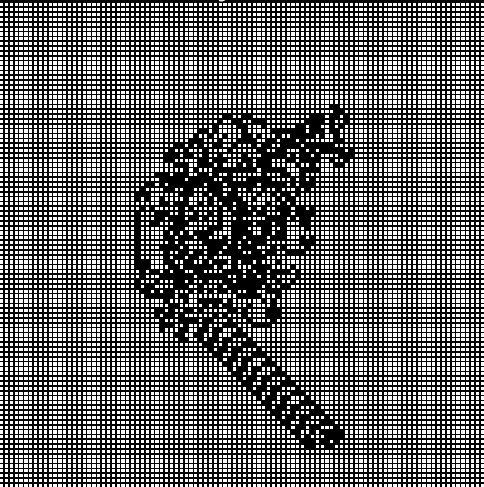

# dependencies
SDL2 library  

# Controls
Pause the simulation by pressing the SPACE keyboard  

# Compile
compile using `make .` in the root directory  

# Examples
`make run` - default configuration  
`./bin/main <grid_width> <grid_height> - specify the number of rows and columns`  

## Images
Famous pattern that occurs after 10000 iterations  

# TODO
- add functionality that enables the window to be resized based on the position of the ant  
- add command line arguments that enable furthe rconfiguration, such as the speed, number of colors(in the future)
- optimize the drawing of the grid so that the whole grid doesn't have to be redrawn on every iteration
- add more keyboard shortcuts
